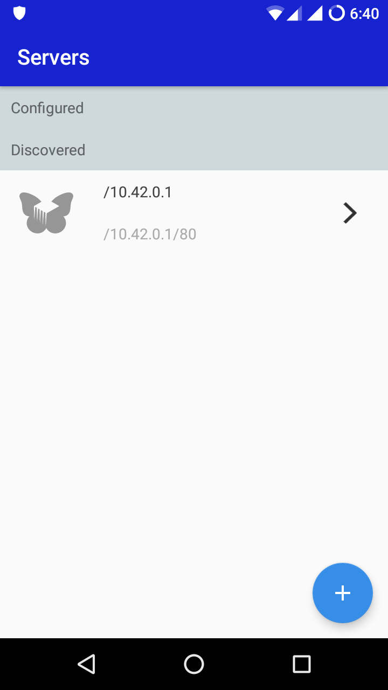
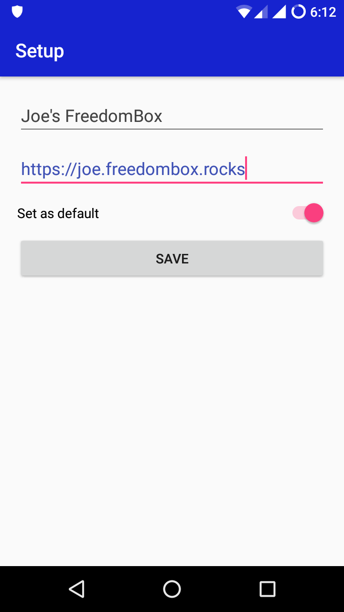
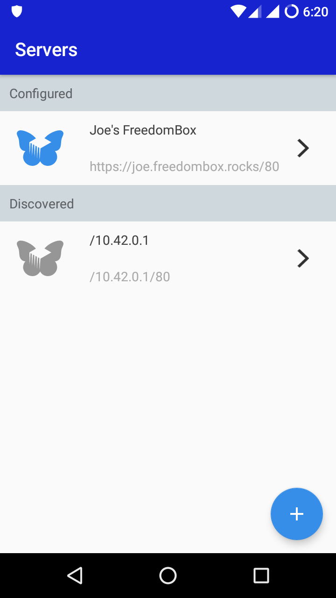
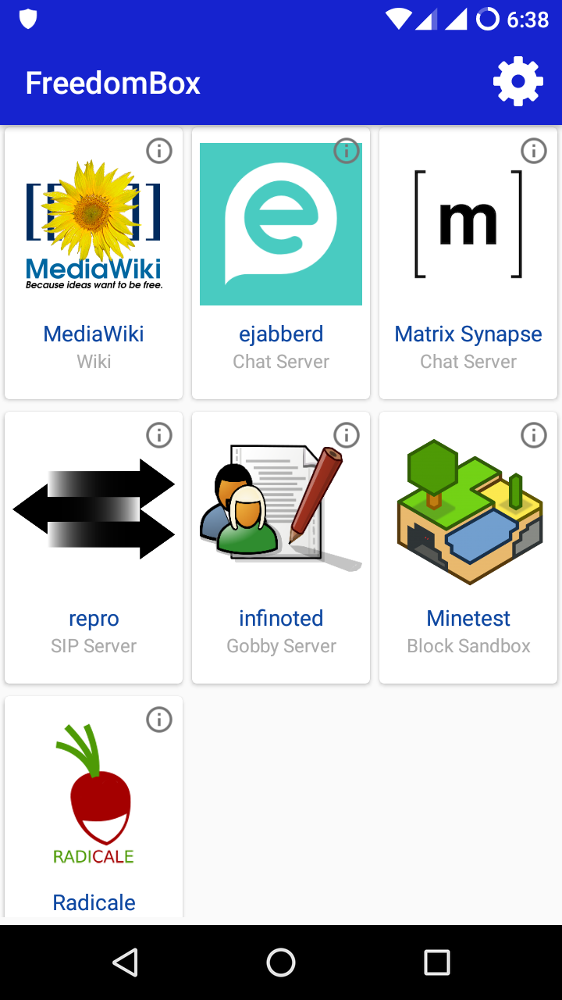

# FreedomBox Android App
App to access FreedomBox services from Android devices.

## Features:
- Discover FreedomBoxes in your local network
- Connect to a FreedomBox (and optionally save it)
- Find and install Android apps for services running on a FreedomBox
- Application launcher for the apps for various services

# Screenshots

Discovery             |  Save Configuration | Select FreedomBox | Launch Apps
:-------------------------:|:-------------------------:|:-------------------------:|:-------------------------:
  |     |     |  

# Install

 

# Localization

